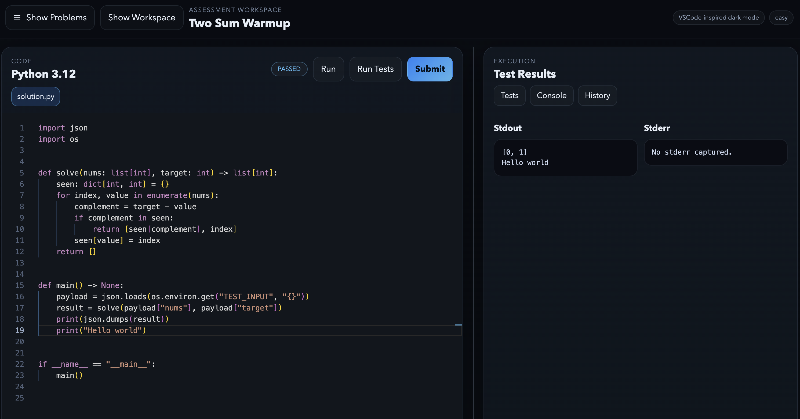
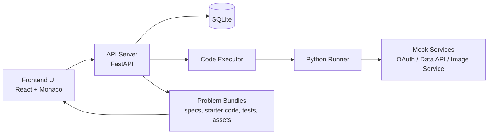

# PractiCode

PractiCode is a local-first coding assessment platform for practical engineering exercises. It combines a LeetCode/Codesignal-style browser workspace with runnable multi-step problems, mock external services, and a one-command local Kubernetes setup.



## Problem It Solves

Most coding platforms are strong at algorithm questions but weak at realistic engineering tasks. PractiCode is designed for assessments that look more like real work:

- calling external APIs
- handling auth flows
- transforming structured data
- inspecting and editing multiple files
- debugging against visible test output
- working inside an IDE-like browser UI instead of a single textarea

The goal is to make it easy to author and run hands-on assessments locally before pushing them toward a more production-like environment.

## High-Level Architecture

PractiCode currently runs as a small local cluster on Kind. The browser UI talks to a FastAPI backend, which manages problems and submissions, dispatches execution work, and coordinates with a Python runner plus problem-specific mock services.



## Main Components

| Path | Purpose |
| --- | --- |
| `frontend/` | Browser UI with problem navigation, Monaco editor, file explorer, run/test/submit actions, and execution results |
| `api-server/` | Problem catalog, file APIs, submission tracking, and execution orchestration |
| `code-executor/` | Execution service that prepares jobs for the language runner |
| `runner-python/` | Python harness and validators used to execute user code and score results |
| `challenges/` | Mock services used by practical problems such as OAuth, data retrieval, and image processing |
| `problems/` | Seeded problem definitions, starter code, tests, docs, and related assets |
| `k8s/` | Kubernetes manifests for the full local stack |
| `scripts/` | Bootstrap scripts used by the Make targets |

## Quick Start

### 1. Prerequisites

Install these locally first:

- `docker`
- `kind`
- `kubectl`
- `python3`
- `make`

### 2. Bootstrap Everything

```bash
make setup
```

`make setup` is the main entrypoint. It runs `make clean` first, then performs the full environment bootstrap:

1. verifies local prerequisites and Docker availability
2. creates `.venv`
3. installs all Python dependencies from `requirements-dev.txt`
4. creates or recreates the `practicode` Kind cluster
5. builds all required Docker images
6. loads those images into Kind
7. deploys the Kubernetes manifests
8. seeds all bundled problems
9. starts background port-forwards for the frontend and API

Once it finishes:

- UI: `http://localhost:3000`
- API docs: `http://localhost:8000/docs`

To see all supported targets:

```bash
make help
```

## Useful Make Targets

| Command | What it does |
| --- | --- |
| `make setup` | Full clean bootstrap for the local cluster and UI |
| `make setup-from-scratch` | Bootstrap without the initial clean step |
| `make status` | Show pods and services across namespaces |
| `make verify` | Run syntax-only verification over the Python services |
| `make stop-port-forward` | Stop the background UI and API forwards |
| `make teardown` | Delete the Kind cluster |
| `make clean` | Alias for `make teardown` |

## Local Service Development

If you want to run pieces outside Kind, the repository also supports direct local service startup:

```bash
make run-oauth
make run-data-api
make run-image-service
make run-executor
make run-api
```

The API server seeds problems from `problems/` on startup, and the local stack uses SQLite by default to keep iteration simple.

## Current Scope

The current repository includes:

- a VSCode-inspired browser assessment UI
- a problem workspace with docs, files, and editable code tabs
- run, test, and submit flows
- problem-scoped assets and file editing
- seeded warmup and practical multi-service problems
- a one-command Kind deployment path for local use

It is optimized for local development and assessment iteration first, with room to evolve toward a more production-like hosted setup later.
